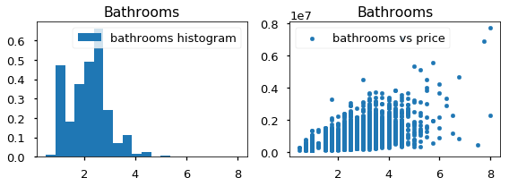

#  Public Opinion From Social Media
## Brand and Product Sentiment From Twitter Using NLP and Machine Learning

**Authors**: Robert Cauvy


### Business problem:

Over the past decade conversations have increasingly shifted towards social media. Businesses across all industries could stand to benefit from listening to these conversations about themselves and how their products and brand are perceived by they users and prospective customers. Understanding what it is that customers enjoy the most and the least about your company's products and brand is crucial to retaining your loyal customers as well as attracting new ones. When large companies announce their new product releases at conferences and keynotes, they can obtain useful market insights and feedback from public opinion. A great source to measure market reactions is the giant social media network, Twitter. In addition to analyzing tweets various machine learning models will be trained and tested to classify tweets as either positive or negative sentiments towards the companies products and services.

It is not easy to obtain unbiased and unfiltered feedback and opinions from the public. Understanding how the market feels about the products and services delivered by your brand in real-time can provide valuable insights that could not get captured before the ubiquity of social media. Applying human capital to track social networks is simply not a scalable solution which makes the application of Natural Language Processing and Machine Learning classifiers well suited for this business problem. The objective of this project is provide the businesses (Apple and Google) a model that identifies which tweets hold either a positive or negative sentiment about their brand or products from a corpus of tweets. Furthermore, this project will provide the stakeholders with a list of topics and keywords that most affect public perception, leaving actionable insights for future marketing and product design decisions.

### Data:
This project is utilizes a dataset provided by CrowdFlower to from data.world. The dataset contains over 9,000 tweets from SXSW(South by Southwest) Conference about new product releases from Apple and Google. The tweet have been labeled as to which emotion they convey towards a particular product category or company brand based off of the language contained in the tweet.

According to the provider of the dataset, humans that were tasked with labeling the sentiments of each tweet by evaluating which brand or product the tweet was about and if the tweet expressed positive, negative, or no emotion towards a brand and/or product.


## Methods
- descriptive analysis
- choices made
- key relevant findings from exploritory data analysis for mod 1, will be more involved in future mod

## Results

### Here are examples of how to embed images from your sub-folder


#### Visual 1 Title


> Sentence about visualization.

#### Visual 2 Title


> Sentence about visualization.


## Recommendations:

More of your own text here


## Limitations & Next Steps

More of your own text here


### For further information
Please review the narrative of our analysis in [our jupyter notebook](./index.ipynb) or review our [presentation](./SampleProjectSlides.pdf)

For any additional questions, please contact **email, email, email)


##### Repository Structure:

Here is where you would describe the structure of your repoistory and its contents, for exampe:

```
├── README.md                 <- The top-level README for reviewers of this project.

├── index.ipynb               <- narrative documentation of analysis in jupyter notebook

├── presentation.pdf          <- pdf version of project presentation

├── images                    <- Images generated from code and externally sourced

├── data                      s<- Tweet data from CrowdFlower used in the analysis


```
